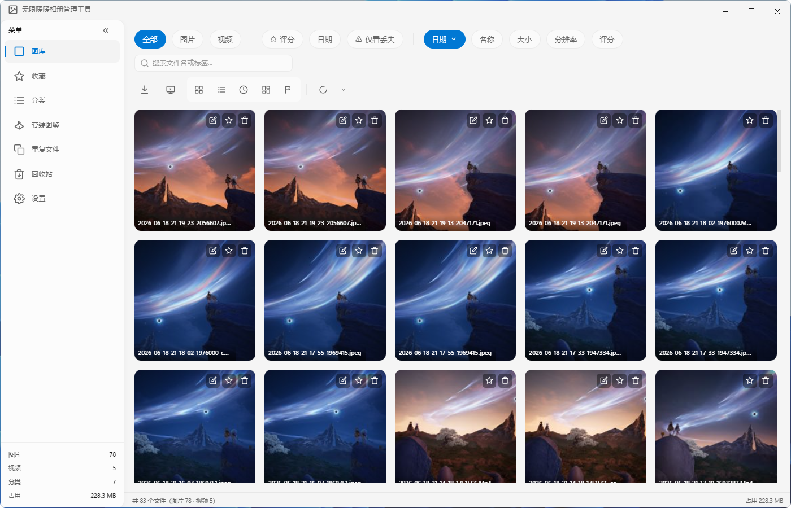
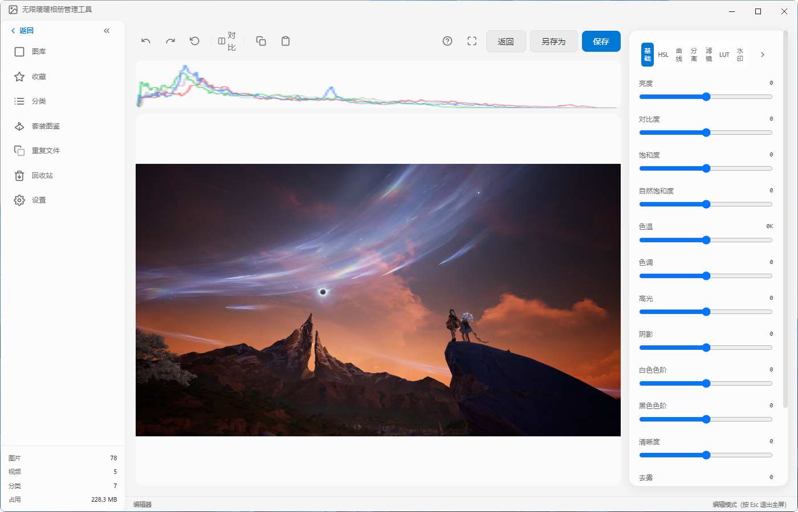
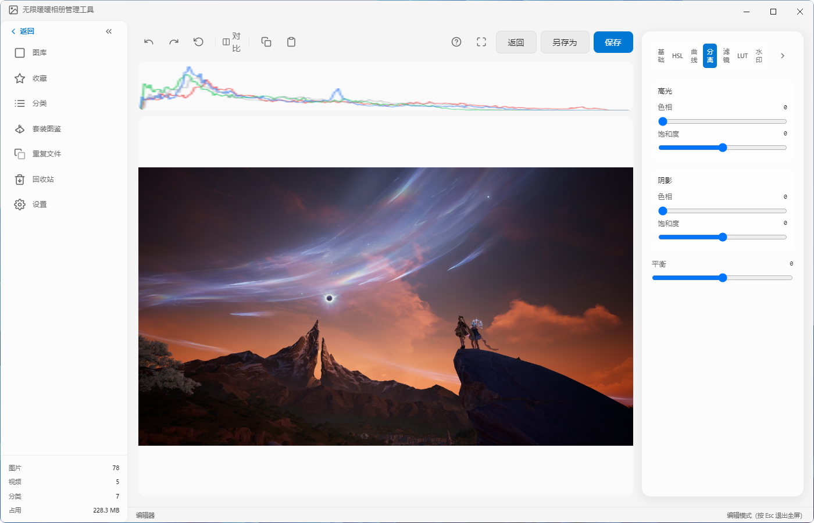
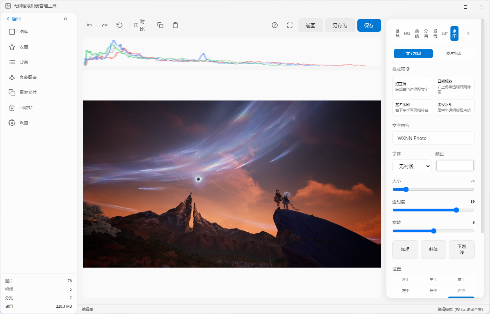
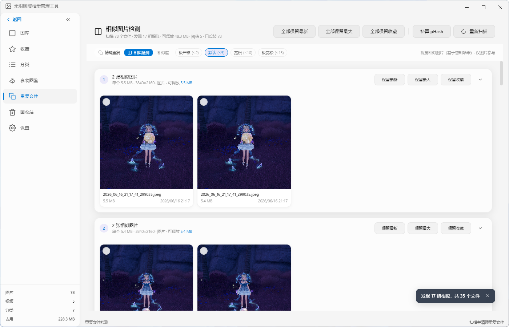
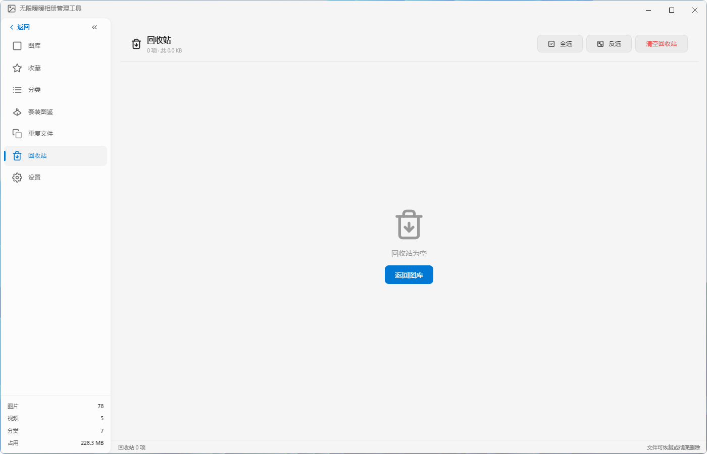
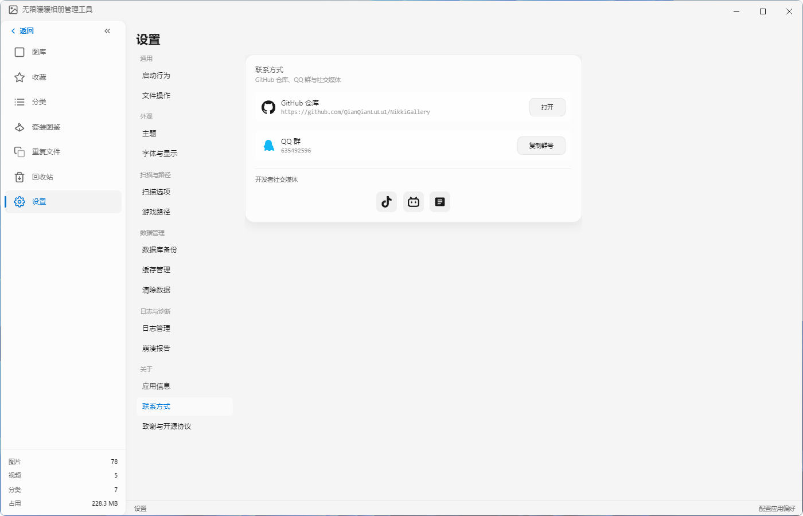

[README_v2.5.md](https://github.com/user-attachments/files/29794068/README_v2.5.md)
<!-- 无限暖暖相册管理工具 v2.5 - GitHub 产品介绍 -->
<!-- Infinity Nikki Gallery Manager v2.5 - GitHub Product Introduction -->

<div align="center">

# 无限暖暖相册管理工具
# Infinity Nikki Gallery Manager

<p>
  
  
  
  
  
</p>

<p>
  <b>专为《无限暖暖》玩家打造的桌面端相册管理与编辑工具</b><br/>
  <b>A desktop gallery management and editing tool tailor-made for Infinity Nikki players</b>
</p>

</div>

---

## 目录 | Table of Contents

- [中文介绍](#中文介绍)
- [English Introduction](#english-introduction)
- [下载 | Download](#下载--download)
- [技术栈 | Tech Stack](#技术栈--tech-stack)
- [社区与支持 | Community & Support](#社区与支持--community--support)

---

# 中文介绍

> 让每一张游戏截图都能得到专业级的整理、修饰与分享。

**无限暖暖相册管理工具** 是一款基于 Electron + React + TypeScript 开发的 Windows 桌面应用，专为《无限暖暖》玩家设计。从智能全盘扫描、多维度分类整理、专业修图到一键分享与局域网同步，提供一站式游戏截图管理解决方案。

---

## 核心功能

### 智能全盘扫描

无需手动指定游戏路径，应用通过文件名签名在所有磁盘上进行深度搜索，自动定位《无限暖暖》的媒体目录。支持识别 22 种游戏内专属相册文件夹（游戏截图、高质量照片、杂志照、打卡照、拼图、自定义头像等），自动按账号 UID 归档到对应角色档案。扫描过程智能跳过系统目录，支持并发多盘符扫描，首次全盘扫描在 5 万文件系统上可在 30 秒内完成。

- **增量扫描**：基于文件修改时间，仅扫描新增或变更的文件
- **深度限制**：最大 15 层递归深度，确保完整覆盖游戏目录结构
- **流式写入**：每 500 条记录批量写入数据库，降低内存峰值

### 图库浏览

以精美的网格形式呈现所有媒体文件，支持响应式列数自适应（2-6 列）。提供网格视图、列表视图和时间线视图三种浏览模式，支持全屏浏览与键盘导航。底部状态栏实时显示图片、视频数量及存储占用。

- **多选模式**：Ctrl 离散选择、Shift 连续选择
- **智能筛选**：按文件类型（图片/视频）、收藏状态、角色档案快速过滤
- **灵活排序**：日期、名称、大小、分辨率、评分多种排序方式
- **关键词搜索**：快速定位目标截图



### 专业图片编辑器

内置功能完善的图片编辑器，无需借助第三方软件即可完成修图。提供从基础参数到专业调色的完整工具链：

- **基础调整**：亮度、对比度、饱和度、自然饱和度、色温、色调、高光、阴影、白色色阶、黑色色阶、清晰度、去雾——12 项参数精细调节
- **HSL 分色调整**：针对红、橙、黄、绿等 8 种颜色独立调整色相、饱和度与明度
- **RGB 曲线**：支持红、绿、蓝及 RGB 综合曲线，Canvas 绘制实现高级色调映射
- **分离色调**：独立调节高光与阴影的色相和饱和度，营造电影感色彩
- **风格滤镜**：原生、清新、日系、森系、明亮、复古、胶片、怀旧等 8 款一键滤镜
- **LUT 支持**：可导入 `.cube` 格式 LUT 文件，内置港色、香港电影、暖调复古、冷调戏剧、高对比等专业调色预设
- **水印工具**：支持文字水印与图片水印，提供拍立得、日期标签、签名水印、版权声明等样式预设，可调节大小、透明度、旋转角度与位置
- **撤销/重做**：完整历史栈管理，支持全局操作历史持久化







### 多维度智能分类

超越传统的平铺文件列表，提供六种维度的智能分组，用户可自由切换或组合筛选：

1. **游戏相册类型**：基于文件夹名自动映射 22 种游戏内相册类型
2. **拍摄场景**：人物、地点、风景、室内、室外等智能场景识别
3. **拍摄时段**：基于图像亮度分析自动区分日景、晨景、暮景、夜景
4. **套装标注**：按套装分组查看与筛选
5. **文件类型**：图片、视频快速切换
6. **自定义分类**：支持手动创建多级嵌套分类（最多 3 级），拖拽调整层级关系，自定义颜色标签

同时支持标签管理，可为截图添加多个标签并获取常用标签建议。


### 套装图鉴

独立的套装图鉴页面，按游戏内套装整理和浏览截图，方便玩家按穿搭主题回顾和查找照片。

### 角色档案管理

支持多账号/多角色档案管理：

- 扫描时自动从文件路径识别 UID（8-12 位纯数字）并归档到对应档案
- 未识别 UID 的文件归入"默认档案"
- 支持添加、编辑、删除角色档案（设置 UID、昵称、头像）
- 档案详情页展示拍摄统计、套装偏好、场景偏好、时段偏好
- 侧边栏快速切换档案，图库即时按档案过滤

### 重复文件检测

提供双重检测机制，高效清理图库：

- **精确重复**：基于文件内容 Hash，找出完全相同的文件
- **相似检测**：基于感知 Hash (pHash)，识别视觉上高度相似的图片，支持极严格到极宽松五级相似度阈值
- **智能评分**：基于分辨率、文件大小、拍摄时间、清晰度综合评分，自动推荐最佳保留版本

检测完成后可批量执行保留最新、保留最大、保留收藏或保留推荐版本等清理策略。图库默认隐藏重复项，可一键显示。



### 安全回收站

删除的文件先进入回收站，支持全选、反选与一键清空操作。在彻底删除前随时可恢复误删文件，避免珍贵截图意外丢失。



### 一键分享

支持将截图通过多种方式分享：

- **剪贴板分享**：一键将截图分享至微信、QQ 和 vivo 办公套件。应用会智能检测目标应用的安装与运行状态，提供针对性引导
- **WiFi 局域网分享**：在同一局域网内通过 WebDAV 服务分享图库，其他设备可直接访问

检测逻辑采用四层回退链（注册表、卸载项、常用目录、进程反向查找），确保在各种 Windows 环境中都能可靠定位目标应用。

### Live Photo 实况图导出

支持将游戏内的动态影集导出为 Live Photo 格式（.mov + .jpg + EXIF ContentIdentifier 关联），可在 iOS 设备上查看动态效果。

### 幻灯片播放

支持全屏幻灯片播放，自动轮播图库中的照片，提供沉浸式回顾体验。

### 批量导出与重命名

- **批量导出**：支持多选文件一键导出到指定目录
- **智能命名规则**：支持变量模板（日期、相册类型、UID、原文件名、序号等）自动重命名
- **导出格式**：图片支持原格式导出，视频支持 mp4、webm、gif、avi、mov 多种格式

### 缩略图分级加载

采用分级加载策略优化浏览性能：

- 首次渲染优先加载低质量缩略图（64px），确保 200ms 内显示
- 滚动停止 300ms 后自动替换为标准质量版本（256px）
- LRU 缓存淘汰机制，自动管理缩略图缓存空间

### 多语言支持

内置国际化框架，支持多语言切换（后续将持续扩展语言包）。

### 日志与诊断系统

- **日志管理**：独立页面查看运行日志，支持按日期筛选与清理。日志采用 JSONL 格式存储，自动滚动，总大小限制在 5GB
- **崩溃报告**：自动收集崩溃时的堆栈与环境信息，保留最近 20 份报告，便于开发者快速定位问题
- **启动诊断**：启动时自动检测运行环境，提供清晰的错误信息

### 数据管理工具

- **数据库备份**：一键导出当前图库数据库，防止数据意外丢失
- **缓存管理**：查看并清理缩略图与视频缓存
- **清除数据**：彻底重置应用数据到初始状态

### 丰富的设置选项

设置页面重构为八大模块，结构清晰：

- **通用**：启动行为、默认导出路径、导出命名规则
- **外观**：默认简约与柔粉轻奢两种主题一键切换，浅色/深色/跟随系统三种模式
- **语言**：多语言切换
- **角色档案**：档案管理与切换
- **扫描与路径**：全盘扫描/增量扫描选项
- **数据管理**：数据库备份、缓存清理、数据重置
- **日志与诊断**：日志查看与崩溃报告管理
- **关于**：应用信息、一键直达 GitHub 仓库、QQ 群与开发者社交媒体



---

# English Introduction

> Bringing professional-grade organization, retouching, and sharing to every in-game screenshot.

**Infinity Nikki Gallery Manager** is a Windows desktop application built with Electron, React, and TypeScript, designed specifically for *Infinity Nikki* players. From intelligent full-disk scanning, multi-dimensional categorization, professional photo editing, one-click sharing, to LAN synchronization, it offers an all-in-one solution for managing your game screenshots.

---

## Key Features

### Intelligent Full-Disk Scanning

No need to manually specify game paths—the app performs deep signature-based searches across all drives to automatically locate *Infinity Nikki* media directories. It recognizes 22 in-game album folder types (Screenshots, High Quality Photos, Magazine Photos, Clock-in Photos, Collages, Custom Avatars, etc.) and automatically archives files by account UID into corresponding character profiles. The scan intelligently skips system directories, supports concurrent multi-drive scanning, and completes the first full scan on a 50,000-file system within 30 seconds.

- **Incremental Scanning**: Based on file modification time, only scans new or changed files
- **Depth Limit**: Up to 15 levels of recursive depth to ensure complete coverage
- **Streamed Writes**: Batches 500 records per database write to reduce memory peaks

### Gallery Browsing

Presents all media files in a beautiful grid layout with responsive column adaptation (2-6 columns). Offers three viewing modes: Grid, List, and Timeline, with full-screen browsing and keyboard navigation. The bottom status bar displays real-time stats for image count, video count, and storage usage.

- **Multi-Select**: Ctrl for discrete selection, Shift for continuous selection
- **Smart Filtering**: Quickly filter by file type (Image/Video), favorite status, or character profile
- **Flexible Sorting**: Date, name, size, resolution, or rating
- **Keyword Search**: Quickly locate target screenshots


### Professional Photo Editor

A fully-featured built-in editor lets you retouch screenshots without third-party software. It provides a complete toolchain from basic adjustments to professional color grading:

- **Basic Adjustments**: Fine-tune brightness, contrast, saturation, vibrance, color temperature, tint, highlights, shadows, whites, blacks, clarity, and dehaze—12 parameters in total
- **HSL Color Control**: Independently adjust hue, saturation, and lightness for 8 colors (red, orange, yellow, green, etc.)
- **RGB Curves**: Advanced tone mapping with individual red, green, blue, and composite RGB curves drawn on Canvas
- **Split Toning**: Independently colorize highlights and shadows for a cinematic look
- **Style Filters**: 8 carefully tuned one-click presets including Original, Fresh, Japanese, Forest, Bright, Vintage, Film, and Nostalgic
- **LUT Support**: Import `.cube` LUT files with built-in professional presets such as Hong Kong Tone, HK Cinema, Warm Vintage, Cold Drama, and High Contrast
- **Watermark Tool**: Text and image watermarks with presets like Polaroid, Date Tag, Signature, and Copyright. Adjustable size, opacity, rotation, and position
- **Undo/Redo**: Complete history stack management with persistent global operation history


### Multi-Dimensional Smart Categorization

Going beyond traditional flat file lists, it offers six dimensions of smart grouping that users can freely switch or combine:

1. **Game Album Type**: Automatically maps 22 in-game album folder types based on directory names
2. **Scene**: Intelligent scene recognition (people, locations, landscapes, indoor, outdoor)
3. **Time of Day**: Automatically distinguishes Daytime, Morning, Dusk, and Night based on image brightness analysis
4. **Outfit**: Group and filter by outfit
5. **File Type**: Quick toggle between images and videos
6. **Custom Categories**: Manually create multi-level nested categories (up to 3 levels) with drag-and-drop reordering and custom color labels

Tag management is also supported—add multiple tags to screenshots and get suggestions for frequently used tags.


### Outfit Gallery

A dedicated outfit gallery page organizes and browses screenshots by in-game outfits, making it easy for players to review and find photos by styling theme.

### Character Profile Management

Supports multi-account/multi-character profile management:

- Automatically identifies UID (8-12 digit numbers) from file paths during scanning and archives to the corresponding profile
- Files without recognized UID go to the "Default Profile"
- Add, edit, and delete character profiles (set UID, nickname, avatar)
- Profile detail page shows shooting statistics, outfit preferences, scene preferences, and time-of-day preferences
- Quick profile switching in the sidebar with instant gallery filtering

### Duplicate Detection

Dual detection mechanisms to efficiently clean up your gallery:

- **Exact Duplicates**: Content-based Hash matching to find identical files
- **Similar Images**: Perceptual Hash (pHash) detection for visually similar images, with five strictness levels from Ultra Strict to Ultra Loose
- **Smart Scoring**: Comprehensive scoring based on resolution, file size, capture time, and clarity to automatically recommend the best version to keep

After scanning, batch actions let you keep the newest, largest, favorited, or recommended version. The gallery hides duplicates by default with a one-click toggle to show them.


### Safe Recycle Bin

Deleted files are moved to the recycle bin first, with select-all, invert-selection, and one-click empty options. Accidentally deleted screenshots can be recovered before permanent removal.


### One-Click Sharing

Share screenshots through multiple channels:

- **Clipboard Sharing**: One-click share to WeChat, QQ, and the vivo Office Suite. The app intelligently detects the target application's installation and running status, providing tailored guidance
- **WiFi LAN Sharing**: Share your gallery via a WebDAV service within the same local network, accessible directly from other devices

Detection uses a four-layer fallback chain (registry, uninstall entries, common directories, process reverse lookup) to reliably locate apps across different Windows environments.

### Live Photo Export

Supports exporting in-game dynamic photo collections as Live Photo format (.mov + .jpg + EXIF ContentIdentifier association), viewable as dynamic images on iOS devices.

### Slideshow Playback

Full-screen slideshow playback with automatic photo rotation for an immersive review experience.

### Batch Export & Renaming

- **Batch Export**: Multi-select files and export to a specified directory with one click
- **Smart Naming Rules**: Variable templates (date, album type, UID, original name, sequence) for automatic renaming
- **Export Formats**: Images in original format; videos in mp4, webm, gif, avi, or mov

### Thumbnail Tiered Loading

Optimized browsing performance through a tiered loading strategy:

- First render prioritizes low-quality thumbnails (64px) to display within 200ms
- Automatically replaces with standard quality (256px) 300ms after scrolling stops
- LRU cache eviction to automatically manage thumbnail cache space

### Multilingual Support

Built-in internationalization framework with support for language switching (more language packs will be added continuously).

### Logs & Diagnostics

- **Log Management**: A dedicated page to view runtime logs, filter by date, and clean up. Logs are stored in JSONL format with automatic rolling, capped at 5GB total
- **Crash Reports**: Automatically collects stack traces and environment information on crashes, retaining the most recent 20 reports for quick diagnosis
- **Startup Diagnostics**: Automatically detects the runtime environment at launch and provides clear error messages

### Data Management Tools

- **Database Backup**: One-click export of the current gallery database to prevent accidental data loss
- **Cache Management**: View and clean up thumbnails and video caches
- **Clear Data**: Completely reset app data to its initial state

### Comprehensive Settings

The Settings page is reorganized into eight modules for clear navigation:

- **General**: Launch behavior, default export path, export naming rules
- **Appearance**: Switch between Default Minimal and Soft Pink Luxury themes; Light/Dark/System modes
- **Language**: Multilingual switching
- **Character Profiles**: Profile management and switching
- **Scan & Paths**: Full scan / incremental scan options
- **Data Management**: Database backup, cache cleanup, data reset
- **Logs & Diagnostics**: Log viewer and crash report management
- **About**: App info, one-click access to GitHub repository, QQ group, and developer social media


---

## 下载 | Download

前往 [Releases](https://github.com/QianQianLuLu/NikkiGallery/releases) 页面下载最新版本的安装程序 `无限暖暖相册管理工具 Setup.exe`，双击运行即可完成安装。

Visit the [Releases](https://github.com/QianQianLuLu/NikkiGallery/releases) page to download the latest installer and run it to install.

---

## 技术栈 | Tech Stack

| 技术 / Technology | 版本 / Version | 说明 / Description |
|-------------------|----------------|-------------------|
| Electron | 28 | 桌面框架 / Desktop framework |
| React | 18 | 前端框架 / Frontend framework |
| TypeScript | 5.3 | 类型系统 / Type system |
| Tailwind CSS | 3.4 | 样式方案 / Styling |
| Zustand | 4.5 | 状态管理 / State management |
| better-sqlite3 | 9.4 | 数据库 / Database |
| i18next | 26.3 | 国际化 / Internationalization |
| sharp | 0.33 | 图像处理 / Image processing |
| fluent-ffmpeg | 2.1 | 视频处理 / Video processing |
| vitest | 1.6 | 单元测试 / Unit testing |

---

## 项目结构 | Project Structure

```
wxnn-photo-manager/
├── src/
│   ├── main/              # Electron 主进程
│   │   ├── index.ts       # 主入口
│   │   ├── database/      # SQLite 数据库
│   │   ├── scanner/       # 智能文件扫描器
│   │   ├── thumbnail/     # 缩略图生成
│   │   └── services/      # 业务服务（备份/崩溃/分享/视频/水印等）
│   └── renderer/          # 渲染进程（前端）
│       ├── components/    # 组件
│       ├── pages/         # 页面（图库/编辑器/套装图鉴/回收站等）
│       ├── stores/        # 状态管理
│       └── hooks/         # 自定义 Hooks
├── preview.html           # HTML 预览版
├── package.json
└── README.md
```

---

## 社区与支持 | Community & Support

- **GitHub 仓库 / Repository**: [https://github.com/QianQianLuLu/NikkiGallery](https://github.com/QianQianLuLu/NikkiGallery)
- **QQ 交流群 / QQ Group**: **635492596**
- **开发者 / Developer**: 纤璐不会玩摄影（全网同名）/ QianLu
- **抖音 / Douyin**: [v.douyin.com/XkTzyJeCFIU](https://v.douyin.com/XkTzyJeCFIU/)
- **哔哩哔哩 / Bilibili**: [b23.tv/FtjgFrW](https://b23.tv/FtjgFrW)

---

## 开源协议 | License

本项目基于 MIT 协议开源。 / This project is open-sourced under the MIT License.

---

*© 2026 QianLu. All rights reserved.*
