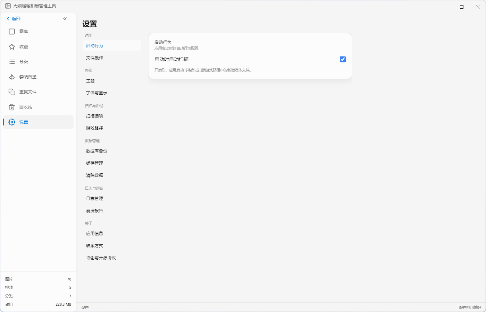
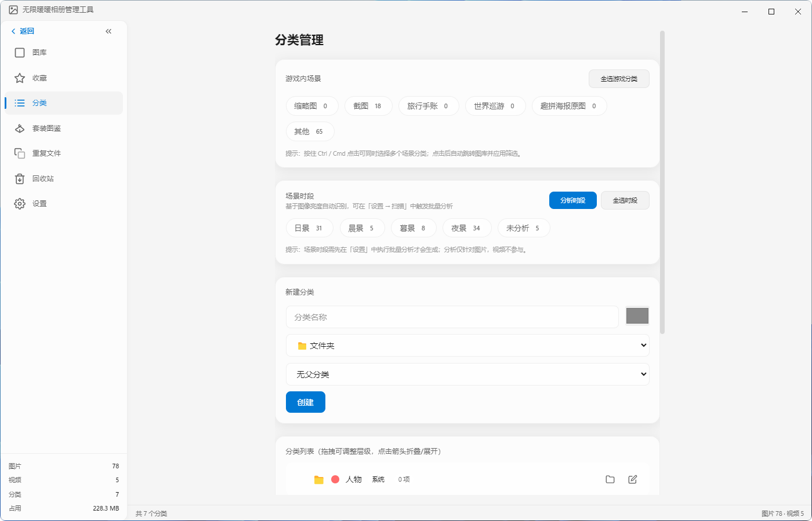
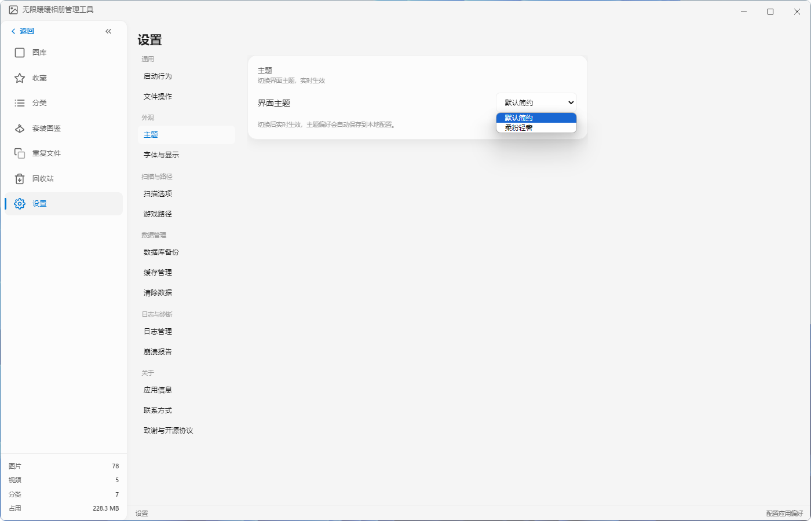

[README.md](https://github.com/user-attachments/files/30189650/README.md)
<div align="center">

# NikkiGallery · 无限暖暖相册管理工具


**扫描 · 浏览 · 编辑 · 分享 · 备份——无限暖暖相册，一站管理**

Scan · Browse · Edit · Share · Backup — one place for every Infinity Nikki screenshot

<br />

**语言 / Language：**　[简体中文](#简体中文) ｜ [English](#english)

</div>

---

## 简体中文

### 项目简介

NikkiGallery 是一款专为《无限暖暖》游戏玩家打造的本地相册管理桌面软件。它能自动定位游戏目录，扫描 16 类媒体文件夹（高清相册、杂志照、打卡照、云相册、截图等），提供网格、列表、时间线、瀑布流、活动时间轴五种浏览视图，内置 22 项专业级图片调整与编辑历史栈，支持重复检测、智能分组、角色档案、分类管理、WiFi 局域网分享与自动备份。所有数据存储在本地 SQLite 数据库，不上传任何云端。

### 产品亮点

| 亮点 | 说明 | 差异化优势 |
|------|------|-----------|
| **本地优先隐私** | 全部数据本地存储，零云端上传 | 区别于云相册产品，玩家数据完全自主可控 |
| **游戏深度集成** | 自动定位游戏目录（Steam / Epic / 默认路径 / 全盘签名四级查找），支持 16 类媒体签名文件夹 | 通用相册软件需手动指定目录，NikkiGallery 开箱即用 |
| **游戏参数解密** | 通过 koffi 调用 `nuan5_decryption.dll`，还原拍照时的姿势、光圈、灯光、滤镜、套装、染色、交互对象 | 让每张照片的"拍摄配方"可读可复用 |
| **专业级编辑** | 22 项调整（曝光 / 对比 / HSL 8 色独立 / 曲线多通道 / 色调分离 / LUT / 水印）+ 编辑历史栈 + 批量应用 | 接近 Lightroom 级别的调色能力，无需切换软件 |
| **双重重复检测** | SHA256 精确比对 + 感知哈希 pHash 视觉相似检测，4 维智能评分推荐保留项 | 既查完全重复，也查视觉相似，清理更彻底 |
| **5 种浏览视图** | 网格 / 列表 / 时间线 / 瀑布流 / 活动时间轴 | 覆盖整理、检索、回顾三种使用场景 |
| **12 种语言** | zh-CN / zh-TW / en / ja / ko / fr / de / es / pt / ru / th / vi，含"跟随系统"选项 | 面向全球无限暖暖玩家 |
| **WiFi 局域网分享** | PIN 鉴权 + Range 支持，微信 / QQ / vivo 剪贴板分享 | 无需数据线即可传到手机 |

### 功能特性

#### 媒体扫描

- 自动定位游戏目录：Steam 注册表 + libraryfolders.vdf、Epic 注册表、默认已知路径、全盘签名搜索四级查找
- 识别 16 类游戏内专属相册文件夹（高清相册、杂志照、打卡照、云相册、截图、拼图、自定义头像等）
- 增量扫描：基于文件修改时间，仅扫描新增或变更的文件
- 智能跳过系统目录与云同步目录（OneDrive / iCloud / Dropbox），并发多盘符扫描
- 最大 15 层递归深度，每 500 条记录流式批量写入数据库

#### 图库浏览

- 5 种视图：网格、列表、时间线、瀑布流、活动时间轴
- 虚拟滚动：万级文件流畅滚动
- 分级缩略图加载：首屏 64px 低质量占位（200ms 内显示），滚动停止 300ms 后替换为 320px 标准质量
- 多选模式：Ctrl 离散选择、Shift 连续选择
- 全屏浏览与键盘导航
- 智能筛选：按文件类型、收藏状态、角色档案快速过滤
- 灵活排序：日期、名称、大小、分辨率、评分

#### 详情查看

- EXIF 拍摄参数解析（光圈、快门、ISO 等）
- 游戏相机参数解密：姿势、灯光、滤镜、套装、染色、交互对象
- 套装与染色信息展示
- 坐标定位与场景识别

#### 图片编辑

- 22 项调整：亮度、对比度、饱和度、自然饱和度、色温、色调、高光、阴影、白色色阶、黑色色阶、清晰度、去雾等
- HSL 8 色独立调色（红、橙、黄、绿、青、蓝、紫、洋红）
- RGB 曲线多通道（红 / 绿 / 蓝 / 综合），Canvas 绘制实现高级色调映射
- 色调分离：独立调节高光与阴影的色相和饱和度
- LUT 支持：导入 `.cube` 格式文件，内置港色、香港电影、暖调复古、冷调戏剧、高对比等预设
- 风格滤镜：原生、清新、日系、森系、明亮、复古、胶片、怀旧 8 款一键滤镜
- 水印工具：文字水印与图片水印，拍立得、日期标签、签名、版权声明等样式预设
- 编辑历史栈：最多 50 步撤销 / 重做，全局操作历史持久化
- 批量应用：将编辑参数一键应用到多张图片

#### 视频处理

- 视频缩略图提取（ffmpeg 抽帧，30 秒超时保护）
- 视频元数据读取（时长、分辨率、编码、码率）
- 视频裁剪与调速（0.25x - 4.0x）
- 格式转换：mp4、webm、gif、avi、mov
- Apple Live Photo 导出（.mov + .jpg + EXIF ContentIdentifier 关联）

#### 重复检测

- 精确重复：基于文件内容 SHA256，找出完全相同的文件
- 相似检测：基于感知哈希 pHash，识别视觉上高度相似的图片，支持极严格到极宽松五级阈值
- 智能评分：基于分辨率（40 分）、文件大小（30 分）、拍摄时间（20 分）、收藏加权（10 分）综合评分，自动推荐最佳保留版本
- 批量清理策略：保留最新、保留最大、保留收藏、保留推荐版本

#### 智能分组

6 维度聚合，可自由切换或组合筛选：

1. 游戏相册类型：基于文件夹名自动映射 16 种游戏内相册类型
2. 拍摄场景：人物、地点、风景、室内、室外智能识别
3. 拍摄时段：基于图像亮度分析自动区分日景、晨景、暮景、夜景
4. 套装标注：按套装分组查看与筛选
5. 文件类型：图片、视频快速切换
6. 自定义分类：手动创建多级嵌套分类（最多 3 级），拖拽调整层级，自定义颜色标签

#### 角色档案

- 多账号 / 多角色档案管理
- 扫描时自动从文件路径识别 UID（8-12 位纯数字）并归档
- 支持添加、编辑、删除角色档案（设置 UID、昵称、头像）
- 跨档案转移文件
- 档案详情页展示拍摄统计、套装偏好、场景偏好、时段偏好

#### 分类管理

- 系统分类 + 自定义分类树
- 拖拽排序，颜色与图标配置
- 最多 3 级嵌套
- 标签管理：添加多个标签，常用标签建议

#### 回收站

- 软删除 / 恢复 / 彻底删除 / 清空
- 二次确认，防止误操作
- 三阶段事务保证数据一致性

#### 分享

- 剪贴板分享：一键分享至微信、QQ、vivo 办公套件，智能检测目标应用安装与运行状态
- WiFi 局域网分享：通过 WebDAV 服务在局域网内分享图库，PIN 鉴权 + Range 支持
- 四层回退检测链：注册表、卸载项、常用目录、进程反向查找

#### 备份恢复

- 自动定时备份（每 7 天）+ 手动备份
- 按档案 UID 后缀识别
- 5 份 LRU 保留，自动清理最旧备份

#### 国际化与主题

- 12 种语言切换，含"跟随系统"选项
- 默认简约主题 + 柔粉轻奢主题
- 浅色 / 深色 / 跟随系统三种模式
- CSS 变量驱动，切换零 JS 重渲染

#### 日志与诊断

- 日志管理：JSONL 格式存储，自动滚动，总大小限制 5GB
- 崩溃报告：保留最近 20 份，自动收集堆栈与环境信息
- 启动诊断：启动时自动检测运行环境

### 技术架构

| 层 | 技术 | 版本 | 用途 |
|----|------|------|------|
| 运行时 | Electron | 30.5 | 跨平台桌面应用框架 |
| 前端框架 | React | 19.2 | UI 渲染与状态管理 |
| 类型系统 | TypeScript | 5.9 | strict 模式，跨进程类型共享 |
| 构建工具 | Vite | 5.4 | 渲染进程 HMR 与打包 |
| 样式方案 | Tailwind CSS | 3.4 | 原子化 CSS，CSS 变量驱动主题 |
| 状态管理 | Zustand | 5.0 | 轻量状态管理 |
| 动画库 | Motion | 12.4 | React 声明式动画 |
| 数据库 | better-sqlite3 | 12.11 | 同步 SQLite，WAL 模式 |
| 图片处理 | sharp | 0.35 | 缩略图与编辑器 pipeline |
| 视频处理 | ffmpeg-static + fluent-ffmpeg | 5.3 / 2.1 | 视频缩略图与转码 |
| EXIF 解析 | exifr | 7.1 | 多格式元数据解析 |
| FFI 调用 | koffi | 3.1 | 调用 nuan5_decryption.dll |
| 参数校验 | zod | 4.4 | IPC 边界 schema 校验 |
| 国际化 | i18next + react-i18next | 26.3 / 17.0 | 12 种语言切换 |
| 测试框架 | Vitest | 1.6 | Vite 原生测试 |

**关键选型决策：**

- **utilityProcess 而非 worker_threads**：scanner / database / media 三个 worker 采用 utilityProcess 实现进程级隔离，单个 worker 崩溃不会影响主进程，稳定性更高。
- **自研 concurrency.ts 而非 p-limit**：p-limit v7 起纯 ESM，与 CommonJS 主进程不兼容，自研并发控制工具避免 `require()` 问题。
- **better-sqlite3 而非 sqlite3**：同步 API，性能高 5-10 倍，通过 utilityProcess 拆分写操作避免阻塞主进程事件循环。
- **koffi 而非 node-ffi-napi**：node-ffi-napi 已停止维护，koffi 持续更新且性能更好。

详细架构说明请参阅 [ARCHITECTURE.md](./docs/项目架构全景.md)。

### 运行截图

<table>
  <tr>
    <td width="50%" align="center"><b>图库网格视图</b><br/>响应式列数自适应与毛玻璃卡片效果</td>
    <td width="50%" align="center"><b>自动定位游戏目录</b><br/>四级查找策略自动扫描游戏媒体文件夹</td>
  </tr>
  <tr>
    <td width="50%" align="center"></td>
    <td width="50%" align="center"></td>
  </tr>
  <tr>
    <td width="50%" align="center"><b>图片编辑器 - 基础调整</b><br/>22 项参数精细调节面板</td>
    <td width="50%" align="center"><b>图片编辑器 - 滤镜预设</b><br/>8 款一键风格滤镜</td>
  </tr>
  <tr>
    <td width="50%" align="center"></td>
    <td width="50%" align="center"></td>
  </tr>
  <tr>
    <td width="50%" align="center"><b>图片编辑器 - 水印工具</b><br/>文字与图片水印，多种样式预设</td>
    <td width="50%" align="center"><b>智能分类管理</b><br/>多维度分组与自定义分类树</td>
  </tr>
  <tr>
    <td width="50%" align="center"></td>
    <td width="50%" align="center"></td>
  </tr>
  <tr>
    <td width="50%" align="center"><b>重复与相似检测</b><br/>双重检测与智能推荐保留项</td>
    <td width="50%" align="center"><b>安全回收站</b><br/>软删除与一键恢复</td>
  </tr>
  <tr>
    <td width="50%" align="center"></td>
    <td width="50%" align="center"></td>
  </tr>
  <tr>
    <td width="50%" align="center"><b>主题切换</b><br/>默认简约与柔粉轻奢双主题</td>
    <td width="50%" align="center"><b>关于与联系方式</b><br/>应用信息与社区入口</td>
  </tr>
  <tr>
    <td width="50%" align="center"></td>
    <td width="50%" align="center"></td>
  </tr>
</table>

### 快速开始

**系统要求：** Windows 10 1803+ 或 Windows 11，x64 架构。

**第一步 · 下载安装**

前往 [Releases](https://github.com/QianQianLuLu/NikkiGallery/releases) 页面下载最新版 NSIS 安装包 `无限暖暖相册管理工具 Setup.exe`，双击运行即可完成安装，支持自定义安装目录。

**第二步 · 首次启动**

启动后应用自动执行首次全盘扫描，定位《无限暖暖》游戏目录与媒体文件夹。扫描耗时取决于游戏照片数量，5 万文件系统约 30 秒内完成。

**第三步 · 开始使用**

在图库中浏览照片，使用编辑器修图，或进入设置中心手动指定游戏目录。后续扫描仅检测新增文件（增量扫描）。

> 普通用户至此即可开始使用。开发者如需参与贡献或本地构建，请继续阅读下方开发指南。

### 开发指南

详细开发文档请参阅 [DEVELOPMENT.md](./Others/DEVELOPMENT.md)，架构说明请参阅 [ARCHITECTURE.md](./Others/ARCHITECTURE.md)。

**环境要求**

- Node.js 20.x LTS
- npm 10+
- Git
- Windows 10 1803+

**安装依赖**

```bash
npm install
```

项目已配置 Electron 与 electron-builder 国内镜像，国内网络环境可正常安装。

**重建原生模块**

```bash
npm run rebuild:native
```

better-sqlite3、sharp、koffi 必须针对 Electron 版本重建，否则启动时会报模块不兼容错误。

**开发模式启动**

```bash
npm run dev
```

编译主进程 TypeScript 并启动 Electron，渲染进程通过 Vite HMR 热更新。

**HTML 预览版**

```bash
npm run preview
```

仅启动渲染层，浏览器访问 `localhost:5173`，用于快速预览界面设计效果，无需运行完整 Electron。

**代码规范**

```bash
npm run lint        # ESLint 检查
npm run lint:fix    # 自动修复
npm run format      # Prettier 格式化
npm run typecheck   # TypeScript 类型检查
```

项目已配置 Husky + lint-staged + commitlint + Commitizen，提交前自动执行 lint 与格式化。

**测试**

```bash
npm test            # 运行 Vitest 单元测试
npm run test:watch  # 监听模式
npm run test:coverage  # 生成覆盖率报告
```

### 打包构建

**构建产物**

```bash
npm run build
```

清理 `dist/renderer/assets` → 编译主进程 TypeScript → Vite 打包渲染进程，产物输出至 `dist/`。

**打包安装程序**

```bash
npm run dist:win
```

执行完整构建后通过 electron-builder 打包为 NSIS 安装程序，产物输出至 `release/`。

**原生模块配置**

`package.json` 的 `build.asarUnpack` 字段已配置以下原生二进制从 asar 解包，确保运行时正确加载：

- `ffmpeg-static` / `ffprobe-static`（视频处理）
- `better-sqlite3`（数据库）
- `sharp` / `@img`（图像处理）
- `koffi`（FFI 调用）
- `nuan5_decryption.dll`（游戏参数解密）

**安装包特性**

NSIS 安装程序，支持自定义安装目录、创建桌面快捷方式与开始菜单快捷方式。

### 更新日志

完整日志请参阅 [CHANGELOG.md](./Others/CHANGELOG.md)。

**v2.3.0**

- 新增：游戏相机参数解密（姿势 / 光圈 / 灯光 / 滤镜 / 套装 / 染色 / 交互对象）
- 新增：瀑布流视图与活动时间轴视图
- 变更：采用 utilityProcess 三进程架构隔离 CPU 密集任务
- 变更：IPC 边界引入 zod schema 校验

**v2.2.0**

- 新增：HSL 8 色独立调色与多通道曲线
- 新增：LUT `.cube` 文件导入支持
- 新增：WiFi 局域网分享（PIN 鉴权 + Range 支持）
- 变更：编辑器调整参数扩展至 22 项

**v2.1.0**

- 新增：双重重复检测（SHA256 + pHash）
- 新增：角色档案管理与按 UID 归档
- 新增：自动定时备份与 5 份 LRU 保留
- 修复：单实例锁未释放导致二次启动失败

### 开源声明

- **开源协议：** [MIT License](./LICENSE)
- **开发者：** QianLu（全网同名：纤璐不会玩摄影）
- **GitHub 仓库：** [QianQianLuLu/NikkiGallery](https://github.com/QianQianLuLu/NikkiGallery)
- **QQ 交流群：** 635492596
- **抖音：** [v.douyin.com/XkTzyJeCFIU](https://v.douyin.com/XkTzyJeCFIU/)
- **哔哩哔哩：** [b23.tv/FtjgFrW](https://b23.tv/FtjgFrW)
- **贡献指南：** 欢迎提交 Issue 与 PR，提交前请确保 `npm run lint`、`npm run typecheck`、`npm test` 全部通过

---

## English

### Overview

NikkiGallery is a local gallery management desktop app built for *Infinity Nikki* players. It automatically locates the game directory, scans 16 types of media folders (high-quality photos, magazine photos, check-in photos, cloud albums, screenshots, etc.), and provides five browsing views—grid, list, timeline, masonry, and event timeline. It ships with 22 professional-grade image adjustments and an edit history stack, plus duplicate detection, smart grouping, character profiles, category management, WiFi LAN sharing, and automatic backup. All data is stored in a local SQLite database with zero cloud upload.

### Highlights

| Highlight | Detail | Differentiator |
|-----------|--------|----------------|
| **Local-first privacy** | All data stored locally, zero cloud upload | Unlike cloud-gallery products, player data stays fully under user control |
| **Deep game integration** | Auto-locates game directory via Steam / Epic / default paths / full-disk signature search; recognizes 16 media signature folders | General gallery apps require manual path setup; NikkiGallery works out of the box |
| **Game parameter decryption** | Calls `nuan5_decryption.dll` via koffi to recover pose, aperture, lighting, filter, outfit, dye, and interaction target | Makes every photo's "shooting recipe" readable and reusable |
| **Pro-grade editing** | 22 adjustments (exposure / contrast / HSL 8-color / multi-channel curves / split toning / LUT / watermark) + edit history stack + batch apply | Lightroom-level color grading without switching software |
| **Dual duplicate detection** | SHA256 exact matching + pHash perceptual similarity, 4-dimension smart scoring for keep recommendation | Catches both exact and visually similar duplicates |
| **5 browsing views** | Grid / list / timeline / masonry / event timeline | Covers organizing, searching, and reviewing scenarios |
| **12 languages** | zh-CN / zh-TW / en / ja / ko / fr / de / es / pt / ru / th / vi, with "follow system" option | Built for global Infinity Nikki players |
| **WiFi LAN sharing** | PIN authentication + Range support, WeChat / QQ / vivo clipboard sharing | Transfer photos to phone without a cable |

### Features

#### Media Scanning

- Auto-locates game directory: Steam registry + libraryfolders.vdf, Epic registry, default known paths, full-disk signature search (4-level fallback)
- Recognizes 16 in-game album folder types (high-quality photos, magazine photos, check-in photos, cloud albums, screenshots, collages, custom avatars, etc.)
- Incremental scanning: only scans new or changed files based on modification time
- Skips system directories and cloud-sync folders (OneDrive / iCloud / Dropbox), concurrent multi-drive scanning
- Up to 15 levels recursive depth, streamed batch writes (500 records per write)

#### Gallery Browsing

- 5 views: grid, list, timeline, masonry, event timeline
- Virtual scrolling: smooth scrolling with tens of thousands of files
- Tiered thumbnail loading: 64px low-quality placeholder within 200ms, 320px standard quality after 300ms scroll stop
- Multi-select: Ctrl discrete, Shift continuous
- Fullscreen browsing with keyboard navigation
- Smart filtering by file type, favorite status, character profile
- Flexible sorting: date, name, size, resolution, rating

#### Detail View

- EXIF parsing (aperture, shutter, ISO, etc.)
- Game camera parameter decryption: pose, lighting, filter, outfit, dye, interaction target
- Outfit and dye information display
- Coordinate localization and scene recognition

#### Image Editing

- 22 adjustments: brightness, contrast, saturation, vibrance, temperature, tint, highlights, shadows, whites, blacks, clarity, dehaze, and more
- HSL 8-color independent grading (red, orange, yellow, green, cyan, blue, purple, magenta)
- RGB multi-channel curves (red / green / blue / composite), Canvas-drawn advanced tone mapping
- Split toning: independent hue and saturation for highlights and shadows
- LUT support: import `.cube` files, built-in presets (Hong Kong Tone, HK Cinema, Warm Vintage, Cold Drama, High Contrast)
- Style filters: 8 one-click presets (Original, Fresh, Japanese, Forest, Bright, Vintage, Film, Nostalgic)
- Watermark tool: text and image watermarks with Polaroid, Date Tag, Signature, Copyright presets
- Edit history stack: up to 50 undo / redo steps, persistent global operation history
- Batch apply: apply edit parameters to multiple images at once

#### Video Processing

- Video thumbnail extraction (ffmpeg frame capture, 30s timeout protection)
- Video metadata reading (duration, resolution, codec, bitrate)
- Video trimming and speed adjustment (0.25x - 4.0x)
- Format conversion: mp4, webm, gif, avi, mov
- Apple Live Photo export (.mov + .jpg + EXIF ContentIdentifier association)

#### Duplicate Detection

- Exact duplicates: content-based SHA256 matching
- Similar images: perceptual hash (pHash) detection, five strictness levels from ultra-strict to ultra-loose
- Smart scoring: resolution (40pts) + file size (30pts) + capture time (20pts) + favorite bonus (10pts), auto-recommends best version to keep
- Batch cleanup strategies: keep newest, keep largest, keep favorited, keep recommended

#### Smart Grouping

6-dimension aggregation, freely combinable:

1. Game album type: auto-maps 16 in-game album folder types
2. Scene: people, locations, landscapes, indoor, outdoor recognition
3. Time of day: auto-classifies daytime, morning, dusk, night based on brightness analysis
4. Outfit: group and filter by outfit
5. File type: quick toggle between images and videos
6. Custom categories: multi-level nested categories (up to 3 levels), drag-and-drop reordering, custom color labels

#### Character Profiles

- Multi-account / multi-character profile management
- Auto-identifies UID (8-12 digit numbers) from file paths during scanning
- Add, edit, delete profiles (set UID, nickname, avatar)
- Cross-profile file transfer
- Profile detail page: shooting stats, outfit preferences, scene preferences, time-of-day preferences

#### Category Management

- System + custom category tree
- Drag-and-drop reordering, color and icon configuration
- Up to 3-level nesting
- Tag management: add multiple tags, frequent tag suggestions

#### Recycle Bin

- Soft delete / restore / permanent delete / empty
- Confirmation prompt to prevent accidents
- Three-phase transaction for data consistency

#### Sharing

- Clipboard sharing: one-click share to WeChat, QQ, vivo Office Suite, with smart app detection
- WiFi LAN sharing: WebDAV service with PIN authentication + Range support
- Four-layer fallback detection: registry, uninstall entries, common directories, process reverse lookup

#### Backup & Recovery

- Automatic scheduled backup (every 7 days) + manual backup
- Identifies profiles by UID suffix
- 5-copy LRU retention, auto-cleans oldest backup

#### Internationalization & Themes

- 12 languages with "follow system" option
- Default Minimal theme + Soft Pink Luxury theme
- Light / Dark / System modes
- CSS variable driven, zero-JS-re-render switching

#### Logs & Diagnostics

- Log management: JSONL format, automatic rolling, 5GB total cap
- Crash reports: retains latest 20, auto-collects stack traces and environment info
- Startup diagnostics: auto-detects runtime environment on launch

### Tech Stack

| Layer | Technology | Version | Purpose |
|-------|-----------|---------|---------|
| Runtime | Electron | 30.5 | Cross-platform desktop framework |
| Frontend | React | 19.2 | UI rendering and state management |
| Type system | TypeScript | 5.9 | strict mode, cross-process type sharing |
| Build tool | Vite | 5.4 | Renderer HMR and bundling |
| Styling | Tailwind CSS | 3.4 | Atomic CSS, CSS variable driven themes |
| State | Zustand | 5.0 | Lightweight state management |
| Animation | Motion | 12.4 | Declarative React animations |
| Database | better-sqlite3 | 12.11 | Synchronous SQLite, WAL mode |
| Image processing | sharp | 0.35 | Thumbnail and editor pipeline |
| Video processing | ffmpeg-static + fluent-ffmpeg | 5.3 / 2.1 | Video thumbnails and transcoding |
| EXIF parsing | exifr | 7.1 | Multi-format metadata parsing |
| FFI | koffi | 3.1 | Calling nuan5_decryption.dll |
| Validation | zod | 4.4 | IPC boundary schema validation |
| i18n | i18next + react-i18next | 26.3 / 17.0 | 12-language switching |
| Testing | Vitest | 1.6 | Vite-native testing |

**Key Technical Decisions:**

- **utilityProcess over worker_threads**: scanner / database / media workers use utilityProcess for process-level isolation—a single worker crash does not affect the main process.
- **Self-built concurrency.ts over p-limit**: p-limit v7+ is pure ESM, incompatible with the CommonJS main process.
- **better-sqlite3 over sqlite3**: synchronous API with 5-10x performance, write operations split into utilityProcess to avoid blocking the main event loop.
- **koffi over node-ffi-napi**: node-ffi-napi is unmaintained; koffi is actively updated with better performance.

For full architecture details, see [ARCHITECTURE.md](./Others/ARCHITECTURE.en.md).

### Screenshots

<table>
  <tr>
    <td width="50%" align="center"><b>Gallery Grid View</b><br/>Responsive columns and frosted-glass cards</td>
    <td width="50%" align="center"><b>Auto-Locate Game Directory</b><br/>Four-level fallback search for game media folders</td>
  </tr>
  <tr>
    <td width="50%" align="center"></td>
    <td width="50%" align="center"></td>
  </tr>
  <tr>
    <td width="50%" align="center"><b>Editor - Basic Adjustments</b><br/>22-parameter fine-tuning panel</td>
    <td width="50%" align="center"><b>Editor - Filter Presets</b><br/>8 one-click style filters</td>
  </tr>
  <tr>
    <td width="50%" align="center"></td>
    <td width="50%" align="center"></td>
  </tr>
  <tr>
    <td width="50%" align="center"><b>Editor - Watermark Tool</b><br/>Text and image watermarks with style presets</td>
    <td width="50%" align="center"><b>Smart Categories</b><br/>Multi-dimensional grouping and custom tree</td>
  </tr>
  <tr>
    <td width="50%" align="center"></td>
    <td width="50%" align="center"></td>
  </tr>
  <tr>
    <td width="50%" align="center"><b>Duplicate & Similar Detection</b><br/>Dual detection with smart keep recommendation</td>
    <td width="50%" align="center"><b>Safe Recycle Bin</b><br/>Soft delete and one-click restore</td>
  </tr>
  <tr>
    <td width="50%" align="center"></td>
    <td width="50%" align="center"></td>
  </tr>
  <tr>
    <td width="50%" align="center"><b>Theme Switching</b><br/>Default Minimal and Soft Pink Luxury themes</td>
    <td width="50%" align="center"><b>About & Contact</b><br/>App info and community links</td>
  </tr>
  <tr>
    <td width="50%" align="center"></td>
    <td width="50%" align="center"></td>
  </tr>
</table>

### Quick Start

**System Requirements:** Windows 10 1803+ or Windows 11, x64 architecture.

**Step 1 · Download & Install**

Visit the [Releases](https://github.com/QianQianLuLu/NikkiGallery/releases) page, download the latest NSIS installer, and run it. Custom installation directory is supported.

**Step 2 · First Launch**

On first launch, the app automatically performs a full-disk scan to locate the *Infinity Nikki* game directory and media folders. Scan time depends on your photo count—typically under 30 seconds for a 50,000-file system.

**Step 3 · Start Using**

Browse photos in the gallery, retouch in the editor, or manually specify the game directory in Settings. Subsequent scans only detect new files (incremental scanning).

> Regular users can start using the app from here. Developers who want to contribute or build locally, continue reading below.

### Development Guide

For full development docs, see [DEVELOPMENT.md](./Others/DEVELOPMENT.en.md). For architecture, see [ARCHITECTURE.md](./Others/ARCHITECTURE.en.md).

**Prerequisites**

- Node.js 20.x LTS
- npm 10+
- Git
- Windows 10 1803+

**Install Dependencies**

```bash
npm install
```

Electron and electron-builder mirrors are pre-configured for networks in China.

**Rebuild Native Modules**

```bash
npm run rebuild:native
```

better-sqlite3, sharp, and koffi must be rebuilt for the Electron version, otherwise startup will fail with module incompatibility errors.

**Development Mode**

```bash
npm run dev
```

Compiles main-process TypeScript and launches Electron. The renderer process supports Vite HMR.

**HTML Preview**

```bash
npm run preview
```

Starts only the renderer layer, accessible at `localhost:5173` in a browser. Useful for quickly previewing UI design without running the full Electron app.

**Code Quality**

```bash
npm run lint        # ESLint check
npm run lint:fix    # Auto-fix
npm run format      # Prettier formatting
npm run typecheck   # TypeScript type check
```

Husky + lint-staged + commitlint + Commitizen are configured for pre-commit hooks.

**Testing**

```bash
npm test            # Run Vitest unit tests
npm run test:watch  # Watch mode
npm run test:coverage  # Generate coverage report
```

### Build & Package

**Build Artifacts**

```bash
npm run build
```

Cleans `dist/renderer/assets` → compiles main-process TypeScript → Vite bundles the renderer. Output goes to `dist/`.

**Package Installer**

```bash
npm run dist:win
```

Runs a full build, then packages via electron-builder into an NSIS installer. Output goes to `release/`.

**Native Module Configuration**

The `build.asarUnpack` field in `package.json` unpacks these native binaries from the asar archive to ensure correct runtime loading:

- `ffmpeg-static` / `ffprobe-static` (video processing)
- `better-sqlite3` (database)
- `sharp` / `@img` (image processing)
- `koffi` (FFI)
- `nuan5_decryption.dll` (game parameter decryption)

**Installer Features**

NSIS installer with custom installation directory, desktop shortcut, and Start Menu shortcut.

### Changelog

Full changelog: [CHANGELOG.md](./Others/CHANGELOG.md).

**v2.3.0**

- Added: game camera parameter decryption (pose / aperture / lighting / filter / outfit / dye / interaction target)
- Added: masonry view and event timeline view
- Changed: adopted utilityProcess three-process architecture for CPU-intensive task isolation
- Changed: introduced zod schema validation at IPC boundaries

**v2.2.0**

- Added: HSL 8-color independent grading and multi-channel curves
- Added: LUT `.cube` file import support
- Added: WiFi LAN sharing (PIN auth + Range support)
- Changed: editor adjustment parameters expanded to 22

**v2.1.0**

- Added: dual duplicate detection (SHA256 + pHash)
- Added: character profile management with UID-based archiving
- Added: automatic scheduled backup with 5-copy LRU retention
- Fixed: single-instance lock not released causing second-launch failure

### License & Community

- **License:** [MIT License](./LICENSE)
- **Developer:** QianLu
- **GitHub:** [QianQianLuLu/NikkiGallery](https://github.com/QianQianLuLu/NikkiGallery)
- **QQ Group:** 635492596
- **Douyin:** [v.douyin.com/XkTzyJeCFIU](https://v.douyin.com/XkTzyJeCFIU/)
- **Bilibili:** [b23.tv/FtjgFrW](https://b23.tv/FtjgFrW)
- **Contributing:** Issues and PRs welcome. Ensure `npm run lint`, `npm run typecheck`, and `npm test` all pass before submitting.

---

<div align="center">

<sub>© 2026 QianLu. All rights reserved.</sub>

</div>
